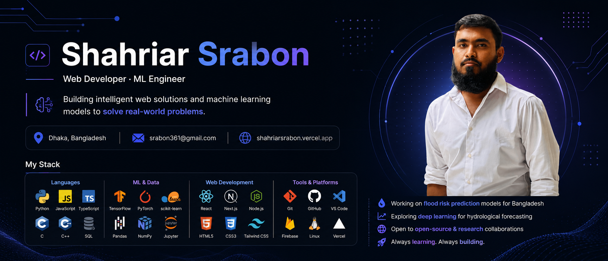

<!--
  ░░ HEADER SWITCH ░░
  Only one of the two blocks below should be uncommented at a time.
  MODE 0 (ASCII banner)  — currently OFF
  MODE 1 (Image banner)  — currently ON
  To switch: comment out the block you don't want, uncomment the other.
-->

<!-- 
░░ MODE 0: ANIMATED ASCII BANNER ░░-->

<!-- ░░ MODE 1: IMAGE BANNER ░░ 

-->
 

> *"Neural nets are not 'just curve fitting'. They are 'just' curve fitting."*
> — **Andrej Karpathy**

---

## 👋 About Me

Hi! I'm **Shahriar Srabon**, a passionate developer and researcher focused on **Web Development**, **Machine Learning**, and **Data Science**. I enjoy working on real-world problems — especially in hydrology, environmental science, and intelligent systems.

- 🔭 Currently working on **flood risk prediction models for Bangladesh**
- 🌱 Exploring **Next.js** and modern full-stack web development
- 🧠 Researching **deep learning approaches** for hydrological forecasting
- 🛠️ Building a **Portfolio** with interactive features
- 💡 Interested in **open-source contributions** and collaborative research
- 📍 Based in **Bangladesh**
- 📬 Reach me at: **srabon361@gmail.com**

---

## 🛠️ Skills & Technologies

**Languages**

**Machine Learning & Data Science**

**Web Development**

**Tools & Platforms**

---

## 📊 Stats

---

## 📌 Highlighted Projects

---

## 🤝 Connect With Me

